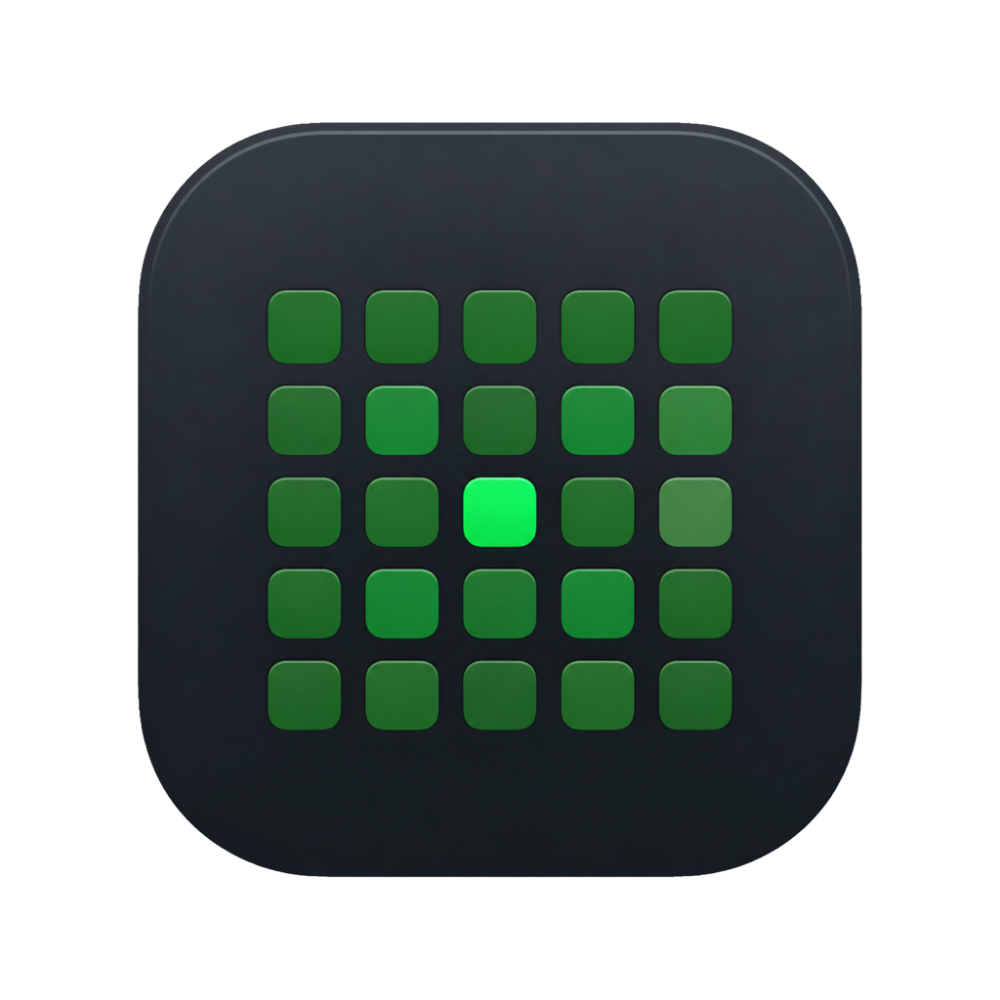
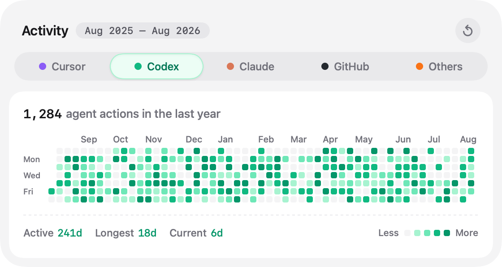

<p align="center">
  
</p>

<h1 align="center">AgentActivity</h1>

<p align="center">A private native macOS menu-bar heatmap for Cursor, Codex, Claude, and GitHub activity.</p>

<p align="center">
  <a href="https://github.com/adithyaakrishna/agent-activity/actions/workflows/ci.yml"></a>
  <a href="https://github.com/adithyaakrishna/agent-activity/releases"></a>
</p>



AgentActivity turns a year of coding-agent work into a compact calendar heatmap. It runs as a menu-bar-only app with no Dock icon or conventional window. Click the grid in the menu bar to compare sources, inspect a day, refresh the current source, or grant access to repository folders used for historical commit correlation.

> [!WARNING]
> Until the release integration removes seeded demo activity, this development build may show deterministic preview data before a live source refresh succeeds. Treat that preview only as interface scaffolding, never as recorded activity.

## Activity sources and accuracy

AgentActivity has five source tabs:

| Tab | Data source | Accuracy boundary |
| --- | --- | --- |
| **Cursor** | Local agent transcripts plus privacy-minimized Cursor hooks | Session timing and observed actions are local records. Cursor does not expose exact personal token totals, so token usage is unavailable. |
| **Codex** | Codex App Server `thread/list` and `account/usage/read` methods | Thread timing and daily usage are reported by App Server usage/thread methods. Local commit and line-change association is derived. |
| **Claude** | Local session transcripts plus privacy-minimized Claude hooks | Claude tokens come from local transcript usage records. Local commit and line-change association is derived. |
| **GitHub** | The authenticated viewer's GraphQL contribution calendar | GitHub uses the authenticated contribution calendar, so daily contribution totals are exact for the authenticated account. Daily contribution types are unavailable. |
| **Others** | Reserved for additional providers and manual imports | No live provider import is implemented; provider-specific metrics are unavailable. |

Commit association remains derived. AgentActivity matches a repository and a session time window unless a provider hook records a specific Git HEAD. A displayed association is useful correlation, not definitive proof that an agent authored a commit. Active time and action counts are also derived from the observed session lifecycle. The seeded preview warning above applies until a live refresh replaces that development-only data.

The detailed official-source analysis is in [Docs/activity-data-sources.md](Docs/activity-data-sources.md).

## Requirements

- macOS 13 Ventura or later.
- A private-repository account with access to `adithyaakrishna/agent-activity` for release downloads.
- GitHub CLI only when using the GitHub tab or local release commands.
- Cursor, Codex, or Claude local history for the corresponding source tab.

Release downloads are universal binaries for Apple silicon and Intel Macs.

## Install from the private release

1. Open the private [Releases](https://github.com/adithyaakrishna/agent-activity/releases) page while signed in to the authorized GitHub account.
2. Download the signed and notarized `AgentActivity-<version>-macos-universal.dmg` and its adjacent `.sha256` file.
3. Verify the download from Terminal:

   ```bash
   shasum -a 256 -c AgentActivity-<version>-macos-universal.dmg.sha256
   ```

4. Open the DMG and drag **AgentActivity** into **Applications**.
5. Launch AgentActivity. Its adaptive monochrome grid appears in the menu bar.

The release also includes a metadata-preserving universal ZIP and its checksum for direct deployment.

## Install or remove Cursor and Claude hooks

The app bundle includes a native helper with no Homebrew or `jq` dependency. Install both user-level hook configurations with:

```bash
"/Applications/AgentActivity.app/Contents/Helpers/AgentActivityHook" install
```

The installer copies the helper to `~/Library/Application Support/AgentActivity/bin/AgentActivityHook` and safely merges AgentActivity-owned entries into:

- Cursor: `~/.cursor/hooks.json`
- Claude: `~/.claude/settings.json`

Start a new Cursor or Claude session after installation. Remove only AgentActivity-owned entries and the installed helper with:

```bash
"/Applications/AgentActivity.app/Contents/Helpers/AgentActivityHook" uninstall
```

Install and uninstall preserve unrelated hooks. A malformed configuration stops the operation before either provider config is replaced.

## Local data and permissions

AgentActivity stores forward-looking Cursor and Claude event metadata in `~/Library/Application Support/AgentActivity/hooks/`. The directory contains owner-only JSONL files, one bounded 25 MB rotated backup per provider, and no prompt or response text. The installed helper lives under the adjacent `bin/` directory. Repository-folder choices are stored in the app's macOS preferences.

Historical Cursor and Claude imports read the providers' local transcript locations. Hook events use provider-supplied repository paths. For older sessions without a reliable path, right-click the popover and select **Choose repository folders…**. Grant access only to the repositories you want AgentActivity to inspect. The app correlates Git history only inside those folders and never crawls broad Desktop or Documents directories automatically.

The GitHub tab invokes `gh api graphql` and never reads or stores the GitHub token itself. Authenticate GitHub CLI once:

```bash
gh auth login
gh auth status
```

Private contribution visibility depends on the authenticated account and its granted scopes.

## Develop

AgentActivity is a native Swift Package Manager application with no third-party runtime dependencies.

```bash
git clone git@github.com:adithyaakrishna/agent-activity.git
cd agent-activity
./script/build_and_run.sh
```

Useful local modes:

```bash
./script/build_and_run.sh --debug
./script/build_and_run.sh --logs
./script/build_and_run.sh --telemetry
./script/build_and_run.sh --verify
```

The build script stages `dist/AgentActivity.app`. SwiftPM remains the source of truth.

## Architecture

- `Sources/AgentActivity/App` owns the `NSStatusItem`, fixed-size `NSPopover`, and menu-bar lifecycle.
- `Sources/AgentActivity/Views`, `Models`, and `Stores` render the heatmap and coordinate source refreshes.
- `Sources/AgentActivity/Services` reads Codex App Server methods, the authenticated GitHub contribution calendar, provider history, hook events, and selected Git repositories.
- `Sources/AgentActivityHookCore` performs bounded capture, privacy minimization, Git HEAD inspection, atomic config merges, and surgical uninstall.
- `Sources/AgentActivityHook` exposes `capture`, `install`, and `uninstall` commands.
- `script/` assembles, signs, notarizes, packages, verifies, and publishes universal distributions.

## Test and verify

Run the same quality checks used by CI:

```bash
bash -n script/*.sh script/lib/*.sh
bash script/test_release_lib.sh
swift format lint --recursive --strict Sources Tests Package.swift
swift test --parallel
```

Build and verify an ad-hoc-signed universal distribution:

```bash
VERSION=0.0.0-ci BUILD_NUMBER=1 ./script/build_distribution.sh
VERSION=0.0.0-ci ./script/verify_distribution.sh
```

CI runs these checks for pull requests, pushes to `main`, and manual dispatches. Its four unsigned DMG, ZIP, and checksum files are retained for seven days.

## Release

Run one-time local setup:

```bash
./script/setup_release_credentials.sh github
```

The setup confirms GitHub CLI authentication, finds a **Developer ID Application** identity in the login Keychain, creates the `AgentActivity-Notary` Keychain profile, and stores only the identity and profile names in an ignored `.env` file.

Rehearse the complete unsigned path without tagging, notarizing, pushing, or publishing:

```bash
./script/release.sh github 1.0.0 --dry-run
```

Publish a real private release from a clean `main` branch:

```bash
./script/release.sh github 1.0.0
```

A real release requires:

- Membership in the Apple Developer Program.
- A valid Developer ID Application certificate and private key in the login Keychain.
- A working `AgentActivity-Notary` profile created with Apple ID, Team ID, and an app-specific password.
- An authenticated `gh` session with access to the private repository.
- A clean `main` worktree and an unused or matching `v<version>` tag.

The release signs with hardened runtime, notarizes and staples the application and DMG, verifies Gatekeeper acceptance, generates checksums, creates and pushes the tag, and creates or updates the private GitHub Release.

### Manual GitHub Actions fallback

Use **Actions > Release > Run workflow** only when local release is unavailable. The fallback accepts stable `X.Y.Z` versions only and runs from `main`. Configure exactly these five repository secrets:

| Secret | Purpose |
| --- | --- |
| `DEVELOPER_ID_CERTIFICATE_BASE64` | Base64-encoded Developer ID Application `.p12` certificate |
| `DEVELOPER_ID_CERTIFICATE_PASSWORD` | Password used when exporting the `.p12` |
| `APPLE_ID` | Apple ID used by `notarytool` |
| `TEAM_ID` | Apple Developer Program Team ID |
| `APPLE_APP_SPECIFIC_PASSWORD` | App-specific password used by `notarytool` |

Encode the certificate on macOS with:

```bash
base64 -i DeveloperIDApplication.p12 | pbcopy
```

The fallback validates tag ownership before it accesses release secrets, imports the certificate into a temporary Keychain, creates a temporary notary profile, produces the four versioned binary/checksum artifacts, and verifies notarization. It also publishes `AgentActivity-<version>-build-provenance.txt`, a deterministic human-readable manifest containing the repository, commit, ref, workflow run URL, artifact names, and SHA-256 values. This manifest is build provenance metadata, not a cryptographic GitHub artifact attestation.

The workflow targets a GitHub environment named `release` as an additional policy boundary and always deletes its temporary Keychain. Configure environment protection rules when the repository plan supports them. Required-reviewer protection is not assumed to be available for every private repository on a personal GitHub plan.

Release Drafter groups pull requests into Features, Fixes, Privacy & Security, Accessibility, Performance, Documentation, Dependencies, and Maintenance. It labels pull requests from conventional title prefixes, branch names, and changed paths. Dependabot checks GitHub Actions dependencies weekly. The Release Notes workflow can regenerate categorized notes for an existing `v<version>` release.

## Troubleshooting

**The menu-bar item does not appear.** Quit any older AgentActivity process, launch the copy in `/Applications`, and check Console or run `./script/build_and_run.sh --logs` in a development checkout.

**Cursor or Claude activity does not refresh.** Run the bundled helper's `install` command again, start a new provider session, and confirm the provider config is valid JSON. Hook capture is fail-open, so a recording error never blocks the provider.

**Historical commits or line changes are unavailable.** Use **Choose repository folders…** and select the exact local repositories. Association stays unavailable when a session has no reliable working directory or no commit inside its time window.

**GitHub activity reports an authentication error.** Run `gh auth status`; if needed, run `gh auth login` again with access to the private contributions you expect to see.

**Tokens are unavailable.** Cursor does not expose exact personal token totals. Claude needs readable local transcript usage records. Codex needs a compatible authenticated Codex CLI exposing the required App Server methods.

**A distribution fails verification.** Check that Xcode command-line tools are current. Real releases also require the Developer ID identity, the named notary profile, a stapled ticket, and Gatekeeper acceptance.

## Privacy

AgentActivity has no accounts, analytics, or telemetry upload. It processes activity on the Mac, except for authenticated GitHub contribution requests and Apple notarization during release work. Hook records exclude prompts, responses, transcript contents, commands, tool inputs and results, environment variables, source code, and credentials. AgentActivity never reads or stores the GitHub token. Local Git inspection is restricted to repository paths supplied by providers or explicitly selected by the user.

## Security

Report vulnerabilities to the monitored maintainer address in [SECURITY.md](SECURITY.md). Do not place vulnerability details, prompts, transcripts, credentials, or private repository content in a regular issue.

This is a private product repository. No public open-source license is granted.
